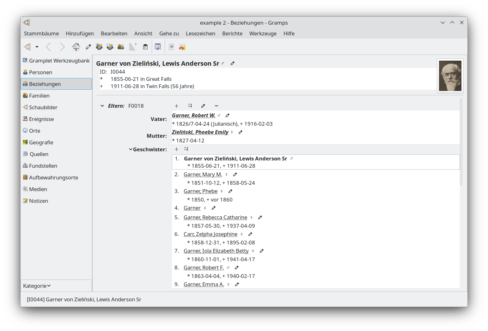
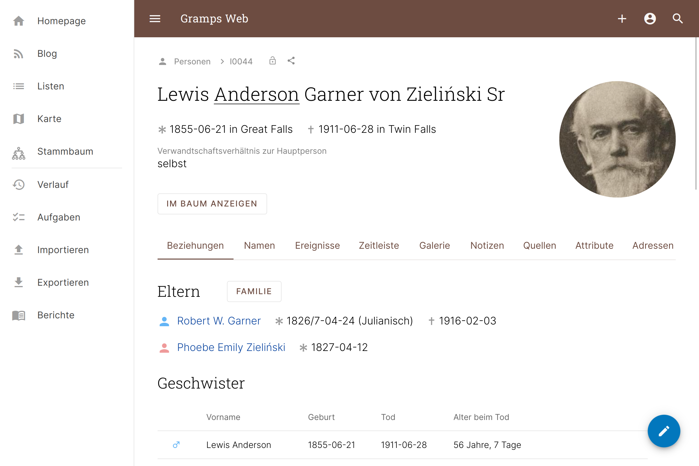
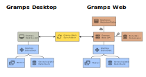
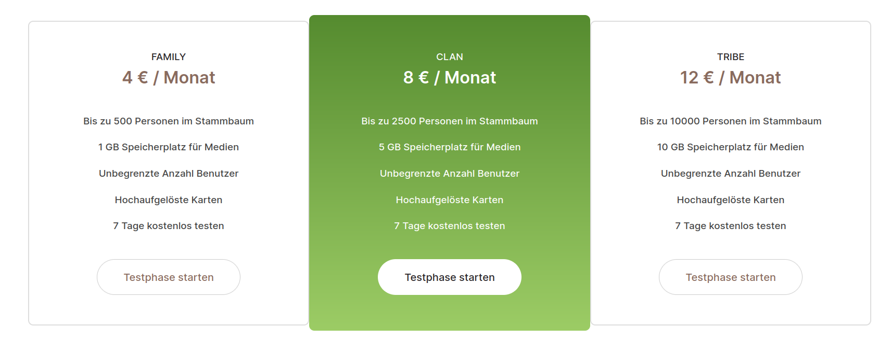

# Gramps Web

### Der digitale Zwilling deiner Ahnen

David Straub

11. Dezember 2023

AK Open Source Software &ndash; Gesellschaft für Informatik

## Über mich

- Physiker/Data Scientist
- aus Wendlingen am Neckar, jetzt München
- Python-Entwicklung seit 8 Jahren
- Nutzer der Open-Source-Software Gramps seit 15 Jahren
- Initiator des Open-Source-Projekts Gramps Web

## 🎄-Zeit ist Genealogie-Zeit!

- Nutze die Zeit, um deine Vorfahren zu befragen ✓
- Tausche dich mit Verwandten aus ✓
- Recherchiere in der Kiste mit Erinnerungen oder im Stadtarchiv ✓
- Setze eine Gramps-Web-Instanz auf! ✓

## Gramps (Desktop)

- Open-Source-Desktop-Genealogie-Programm (GPL)
- v1.0 in 2004, aktiv weiterentwickelt
- Plattformübergreifend (GTK)
- In Python

## Warum Gramps Web?

- Forschungsergebnisse in der Verwandtschaft kommunizieren?
- Zusammenarbeiten?
- Unterwegs auf Handy oder Tablet arbeiten?

<->

## Gramps Web API

- Gramps Datenstruktur: "Primäre Objekte" als JSON-Struktur darstellbar
    - Person, Familie, Ereignis, Ort, Quelle, Fundstelle, Aufbewahrungsort, Notiz, Medienobjekt
- Eine REST API mit `Flask` zum Lesen und Schreiben von Daten unter Verwendung der existierenden Gramps-Python-Bibliothek
    - Datenbankmanagement (SQLite oder PostgreSQL)
    - Genealogische Funktionen
    - Berichterstellung uvm.

[API-Dokumentation ->](https://gramps-project.github.io/gramps-webapi/)

## Gramps.js

- Frontend für die Web App
- Javascript (Web Components &ndash; [`Lit`](https://lit.dev/))
- Single Page App
- Material Design
- Autorisierung am Backend (Web API) mittels JSON Web Tokens (JWT)

### + Gramps (Python)
### + Gramps Web API (Python)
### + Gramps.js (JS)
### = Gramps&nbsp;Web

## Gramps Web: Architektur

## Gramps Web &ndash; Demo

## Installation

- Einfachste Deployment-Methode via Docker Compose
- Drei Optionen:
    - Eigener Server (Raspberry Pi, virtueller Server o.ä.)
    - Docker-Hosting (z.B. Gramps Web DigitalOcean-App)
    - Vollständig gehosteter Dienst (Grampshub)

## Grampshub

- Hosting-Dienst für Gramps Web
- Seit Mitte 2023 von mir betrieben

Kein Provider-Lock-In &ndash; Daten können jederzeit exportiert/migriert werden

## Grampshub: Vorteile

- Keine Installation nötig
- Keine Serverkonfiguration nötig
- Automatische Updates
- Unterstützung des Gramps-Web-Hauptentwicklers&nbsp;🙂

Und wie überall bei Gramps Web: kein Provider-Lock-In &ndash; Vollständiger Export/Import _aller_ Daten mit 3 Klicks

## Grampshub: Nachteile

- Kein Befehlszeilen-Zugang auf den Server
    - Lokale Bearbeitung dank Sync-Addon möglich
- Begrenzte Personenzahl im Baum
    - Umzug zu anderem Server jederzeit möglich
- Keine eigene Domain (familieXYZ.de)

## Mitentwickler*innen herzlich willkommen

- Python: [github.com/gramps-project/gramps-webapi](https://github.com/gramps-project/gramps-webapi)
- Javascript: [github.com/gramps-project/Gramps.js](https://github.com/gramps-project/Gramps.js)
- Python-GTK: [github.com/DavidMStraub/gramps-web-sync](https://github.com/DavidMStraub/gramps-web-sync)

## Mehr Details

Einstündiger Vortrag über Gramps Web beim Ahnenforscher-Stammtisch Unna letzte Woche:

https://youtu.be/Y0NS-LeL-6Q

## Links

- Gramps Web Docs: https://www.grampsweb.org
- Grampshub: https://www.grampshub.com
- Mein Blog: https://www.grampshub.com/blog
- Instagram: https://www.instagram.com/grampshub/
- Foren
    - Compgen-Liste `gramps-l` (deutsch): https://discourse.genealogy.net/c/gramps-l/
    - Gramps-Forum (englisch): https://gramps.discourse.group/c/gramps-web/
